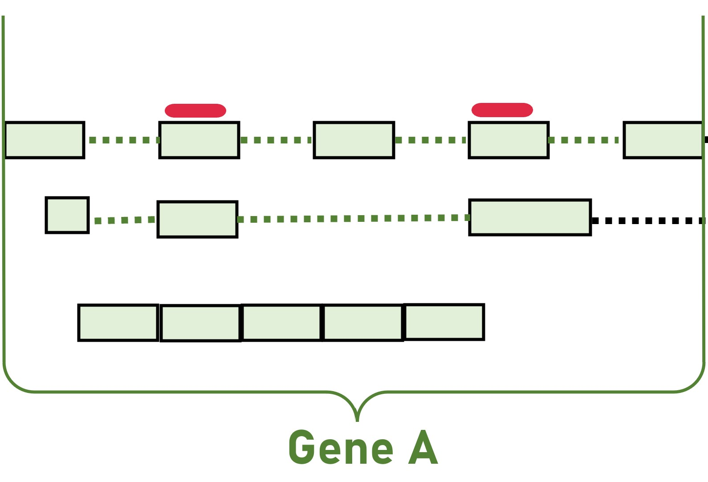
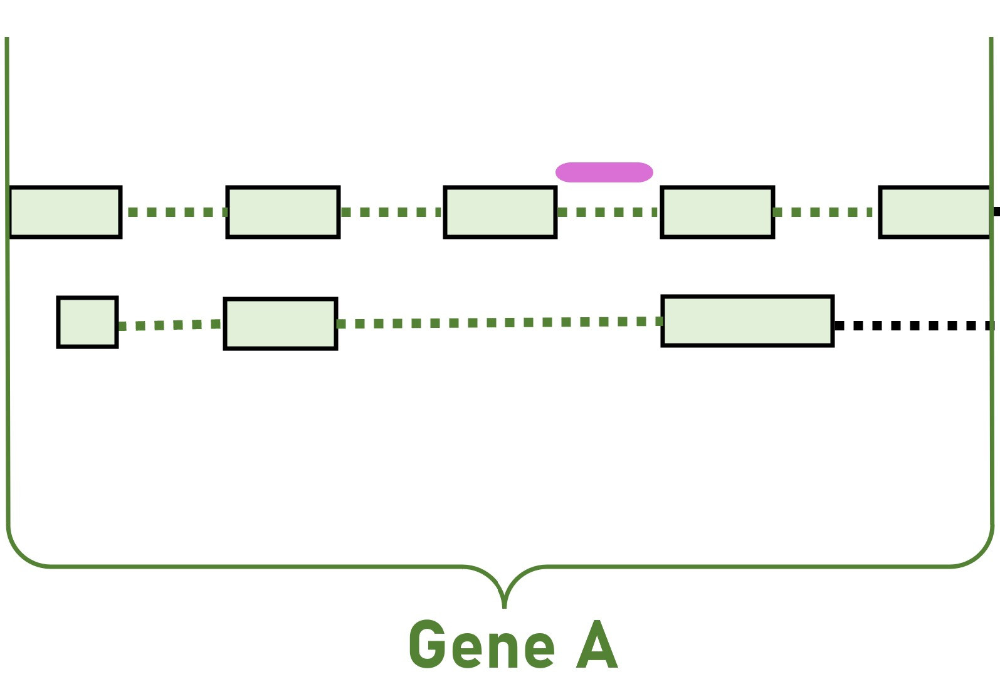
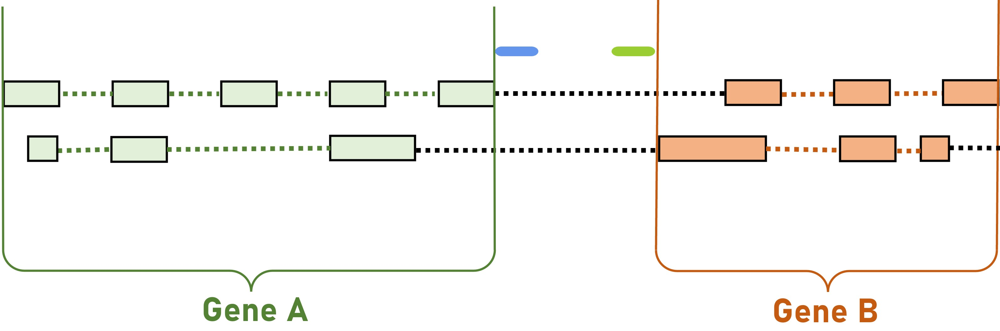
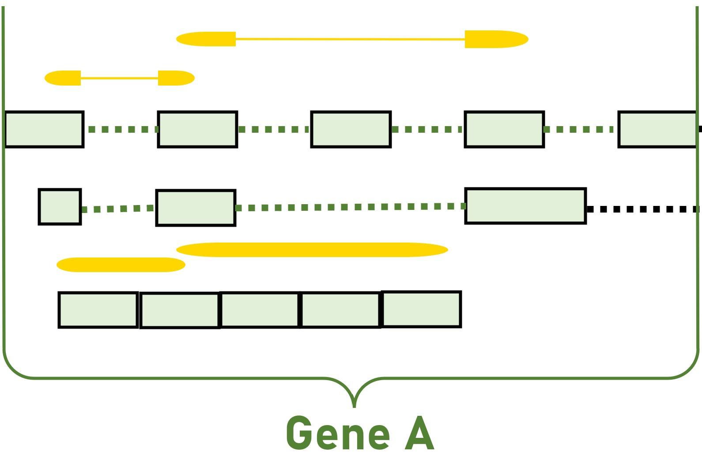
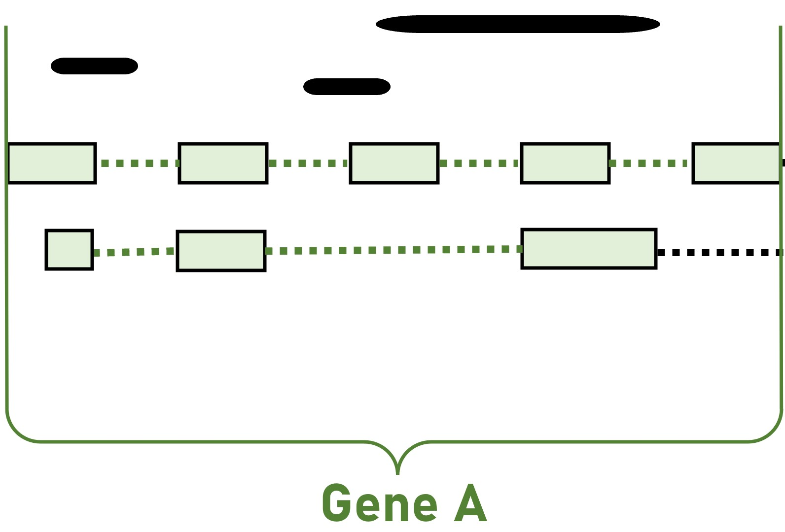

# BRIDGe REU 2023

## Project: Categorizing splicing ambiguity status RNA-sequencing reads in single cell and single nucleus data
Mentor: Dr. Rob Patro

### Purpose of Research
RNA-sequencing(RNA-seq) technologies like 10x Genomics provide the necessary tools and resources for researchers to use freely. Like other RNA-seq technologies, it follows a standard pipeline that goes from sample preparation, where we would obtain the raw data in a fastq file, to the quantification and finally the analysis. However, these tools don’t provide an intermediary between the quantification and the analysis. There isn’t any way to look at the data directly and estimate the splicing status of all of the reads. For this reason, millions of reads are not being accounted for nor do they possess the right splicing status because of splicing ambiguity. Splicing ambiguity occurs because of ambiguous reads. These reads are classified as ambiguous because we do not know whether they are spliced or unspliced. Therefore, it is important to try to categorize these reads to build a preprocessing tool that can better estimate the splicing status of all of the reads that are not being accounted for and provide accurate data.

### Methods
Datasets downloaded from 10x Genomics Resources:
| Tissue Samples | Link |
| ----------- | ----------- |
| 1k Heart Cells from an E18 mouse	| https://www.10xgenomics.com/resources/datasets/10-k-heart-cells-from-an-e-18-mouse-v-3-chemistry-3-standard-3-0-0 |
| 5k Adult Mouse Heart Nuclei Isolated with Chromium Nuclei Isolation Kit	| https://www.10xgenomics.com/resources/datasets/5k-adult-mouse-heart-nuclei-isolated-with-chromium-nuclei-isolation-kit-3-1-standard |
| 5k Mouse E18 Combined Cortex, Hippocampus and Subventricular Zone Cells	| https://www.10xgenomics.com/resources/datasets/5-k-mouse-e-18-combined-cortex-hippocampus-and-subventricular-zone-cells-3-1-standard-6-0-0 |
| 5k Adult Mouse Brain Nuclei Isolated with Chromium Nuclei Isolation Kit	| https://www.10xgenomics.com/resources/datasets/5k-adult-mouse-brain-nuclei-isolated-with-chromium-nuclei-isolation-kit-3-1-standard |

STAR aligner was used to create a genome index with ENCODE’s latest basic primary assembly fasta sequence and basic primary genome annotation of the common mouse and map the reads with very few parameters. The alignment process is important to procure a BAM file, and with samtools, create a BAI file (bam file index). 
I used [genome_index.sh](genome_index.sh) for the genome index and [mapping.sh](mapping.sh) for the quantification of the reads. 
### **Filtering**
1. Reads
   
The reads were filtered by flag to determine which strand of the genome annotation they correspond to. The information we have from the read is limited to the chromosome, the strand, the cigar string, the start and end of the read, and the sequence. For now, we are choosing to ignore the sequence as it is not relevant right now. This is what the first few rows of the dataset would look like after it was filtered:

| chromosome	| start | end	| reads	| length of read | cigar string |
| ----------- | ----------- | ----------- | ----------- | ----------- | ----------- |
| chr1	| 3051023	| 3051035	| 1	| 12	| 16S12M
| chr1	| 3052062	| 3052075	| 1	| 13	| 15S13M
| chr1	| 3056321	| 3056332	| 8	| 11	| 11M17S
| chr1	| 3064598	| 3064610	| 2	| 12	| 16S12M

2. Genes and exons

The genes and exons were filtered by strand orientation and divided into forward and reverse genes and exons. 
This is what the first few rows of the exons dataset would look like:

| Unnamed: 0	| chromosome	| feature	| gene_id	| exon number	| transcript	| start	| end	| strand	| length of exon	| next exon number	| next transcript	| next exon start	| next exon end	| last exon number | first exon start	| last exon end	| distance to gene start	| distance to gene end |
| ----------- | ----------- | ----------- | ----------- | ----------- | ----------- | ----------- | ----------- | ----------- | ----------- | ----------- | ----------- | ----------- | ----------- | ----------- | ----------- | ----------- | ----------- | ----------- |
| 537264	| GL456210.1	| exon	| ENSMUSG00000079192.3	| 1	| ENSMUST00000111364	| 123791	| 123905	| +	| 114	| 2	| ENSMUST00000111364	| 124787	| 124928	| 2	| 123791	| 124928	| 0	| 0 |
| 537265	| GL456210.1	| exon	| ENSMUSG00000079192.3	| 2	| ENSMUST00000111364	| 124787	| 124928	| +	| 141	| |	|	|	|	2	| 123791	| 124928	| 0	| 0 |
| 537269	| GL456210.1	| exon	| ENSMUSG00000094799.2	| 1	| ENSMUST00000115928	| 147791	| 147938	| +	| 147	| 2	| ENSMUST00000115928	| 149488	| 149707	| 2	| 147791	| 149707	| 0	| 0 |
| 537270	| GL456210.1	| exon	| ENSMUSG00000094799.2	| 2	| ENSMUST00000115928	| 149488	| 149707	| +	| 219	|	|	|	|	| 2	| 147791	| 149707	| 0	| 0 |
| 537278	| GL456211.1	| exon	| ENSMUSG00000079190.4	| 1	| ENSMUST00000111360	| 167445	| 167988	| +	| 543	| 2	| ENSMUST00000111360	| 175871	| 176034	| 7	| 167445	| 196478	| 0	| 0 |
| 537279	| GL456211.1	| exon	| ENSMUSG00000079190.4	| 2	| ENSMUST00000111360	| 175871	| 176034	| +	| 163	| 3	| ENSMUST00000111360	| 176916	| 177088	| 7	| 167445	| 196478	| 0	| 0 |

We have the next exon information for every exon on the genome annotation. It is sorted by chromosome, gene_id, transcript and exon number (in that same order) to accurately have the next exon information on the next columns. The genes dataframe would only have the columns; ‘chromosome’, ‘feature’, ‘gene_id’ and ‘strand’.

#### **Within genes**
code: [within_genes.py](within_genes.py)
Interestingly, not all of the reads fall within a gene. Most of the reads are either very close to the start or end of a specific gene. That’s why I decided to assign gene id’s to the reads before assigning them a splicing category. If a read was found within a gene, it would output the name of the gene id to another column; if not, it would return nothing. 
| chromosome	| start | end	| reads	| length of read | cigar string | gene_id |
| ----------- | ----------- | ----------- | ----------- | ----------- | ----------- | ----------- |
| chr1 | 10865506	| 10865519 | 1	| 13 | 15S13M | |
| chr1 | 10866393	| 10866408 | 2	| 15 | 15M13S | |
| chr1 | 10870565	| 10870581 | 1	| 16 | 12S16M | |
| chr1 | 10870868	| 10870884 | 1	| 16 | 16M12S | |
| chr1 | 10876012	| 10876025 | 1	| 13 | 15S13M | ENSMUSG00000100212.2 |
| chr1 | 10881326 | 10881340 | 2	| 14 | 14S14M | |

### Categorization of the reads
#### **Within exons**
code: [within_exons.py](within_exons.py)
This is where it got tricky. Genes can have multiple transcripts with different splicing locations and different amounts of exons. These categories were the most generalized for all of the cases:

1. Ambiguous within an exon: When the read is entirely within an exon, it is ambiguous because we do not know whether the read came from a spliced or an unspliced RNA molecule.
   
<p align="center">
  
</p>

Code snippet:

```python
ambiguous = same_gene[(same_gene['start'] <= read_start) & (same_gene['end'] >= read_end)]
   if not ambiguous.empty:
       #for i in range(len(ambiguous)):            
       amb_exon_name = ambiguous.iloc[0]['transcript']
       amb_exon_number = ambiguous.iloc[0]['exon number']
       ambiguous_result.append([amb_exon_name, amb_exon_number])
       status.clear()
       status.append('A') 
```
2. Intronic: When a read is entirely between exons.
<p align="center">
  
</p>
   
Code snippet:
   
```python
between_exons = same_exon_number[(same_exon_number['end'] < read_start) & (same_exon_number['next exon start'] > read_start)]
  if not between_exons.empty:
      #for i in range(len(intronic)):
      intronic = between_exons[(between_exons['next exon start'] > read_end)]
      if not intronic.empty:
          intr_exon_1 = intronic.iloc[0]['transcript']
          intr_exon_2 = intronic.iloc[0]['next transcript']
          intr_exon_number1 = intronic.iloc[0]['exon number']
          intr_exon_number2 = intronic.iloc[0]['next exon number']
          intronic_result.append([[intr_exon_1, intr_exon_2], [intr_exon_number1, intr_exon_number2]])
          status.append("I")
```
   
3. Untranslated regions (UTRs): When a read is not found within a gene but it is relatively close to the gene start (5'UTR) or to the gene end (3'UTR). For this project, the cuttoff point for the 5'UTR is 1000 bases long and the 3'UTR should be 3.6 times larger than the 5'UTR. However, I didn't specify the 3'UTR to have a cuttoff point because it is much less annotated than the 5'UTR.
   
<p align="center">
  
</p>

Code snippet:

```python

else:
  same_chrom = forward_exons_df[(forward_exons_df['chromosome'] == chrom)]
  if not same_chrom.empty:
      utr_5 = same_chrom[(same_chrom['first exon start'] >= read_end)]
      if not utr_5.empty:
          utr_5_exon_name = utr_5.iloc[0]['transcript']
          utr_5_exon_number = utr_5.iloc[0]['exon number']
          min_dist_5 = min(abs(utr_5['first exon start'] - read_end).min(), abs(utr_5['last exon end'] - read_start).min())
          dist_to_gene_start = utr_5.iloc[0]['distance to gene start']
          if min_dist_5 > (1000+dist_to_gene_start): # define a better cuttoff point for the 5' UTR
              status.append("None")
          else:
              utr_5_result.append([utr_5_exon_name, utr_5_exon_number])
              utr_5_result.append(f"MinDist5:{min_dist_5}")
              status.append("5T")
      else:
          min_dist_5 = float('inf')
      utr_3 = same_chrom[(same_chrom['last exon end'] <= read_start)]
      if not utr_3.empty:
          utr_3_exon_name = utr_3.iloc[0]['transcript']
          utr_3_exon_number = utr_3.iloc[0]['exon number']
          min_dist_3 = min(abs(utr_3['first exon start'] - read_start).min(), abs(utr_3['last exon end'] - read_start).min())
          utr_3_result.append([utr_3_exon_name, utr_3_exon_number])
          utr_3_result.append(f"MinDist3:{min_dist_3}")
          status.append("3T")
          if "None" in status:
              status.clear()
              status.append("3T")
          elif "5T" in status:
              utr_3_result.clear()
              status.clear()
              status.append("5T")
```
4. Spliced: When the read would start in one exon and end in another one. These reads would often be longer than the standard 10-20 bases because during the alignment they skip certain regions where the bases do not match. If the skipped regions where a large chunk, the cigar string would report an 'N' character.
<p align="center">
  
</p>

Code snippet:
``` python
spliced = same_exon_number[(same_exon['start'] <= read_start) & (same_exon_number['end'] >= read_start) & (same_exon_number['next exon start'] <= read_end) & (same_exon_number['next exon end'] >= read_end) | (same_exon['start'] <= read_start) & (same_exon_number['end'] >= read_start) & (same_exon_number['next exon start'] <= read_end) & (same_exon_number['next exon end'] <= read_end)]
  if not spliced.empty: # For short reads
      #for i in range(len(spliced)):
      spl_1 = spliced.iloc[0]['transcript']
      spl_2 = spliced.iloc[0]['next transcript']
      spl_number_1 = spliced.iloc[0]['exon number']
      spl_number_2 = spliced.iloc[0]['next exon number']
      spliced_result.append([[spl_1, spl_2], [spl_number_1, spl_number_2]])
      status.append("S")
if 'N' in cigar: # For long reads
   status.clear()
   status.append("S")
```
   
6. Unspliced: When the read starts in an exon and ends in an intron or vice versa.
<p align="center">
  
</p>

```python
unspliced = between_exons[(between_exons['next exon start'] < read_end) & (between_exons['next exon end'] > read_end)]
   if not unspliced.empty:
       #for i in range(len(unspliced)):
       uns_exon_1 = unspliced.iloc[0]['transcript']
       uns_exon_2 = unspliced.iloc[0]['next transcript']
       uns_exon_number1 = unspliced.iloc[0]['exon number']
       uns_exon_number2 = unspliced.iloc[0]['next exon number']
       unspliced_result.append([[uns_exon_1, uns_exon_2], [uns_exon_number1, uns_exon_number2]])
       status.append("U")
       if 'N' in cigar:
           status.append('S')
```

### Results


### Future work
